Data for three PIXEL ports have been collected from the data-sharing portal AISHub: GPMB, ASPM and PPA. In the AIS notebook, work on analytics of AIS is presented: heatmaps of locations, most common navigation statuses in different areas in the ROIs, most common vessel types in different parts of the ports and neighbour areas, errors in AIS data, comparison of reported and fixed navigational statuses, voyages from entering the ROI, anchoring, mooring and leaving the region.

# AIS (Automatic identification system) data

IMO adopted a new requirement for all ships to carry automatic identification systems (AISs) capable of providing information about the ship to other ships and to coastal authorities automatically.

The regulation requires AIS to be fitted aboard all ships of 300 gross tonnage and upwards engaged on international voyages, cargo ships of 500 gross tonnage and upwards not engaged on international voyages and all passenger ships irrespective of size. The requirement became effective for all ships by 31 December 2004. 

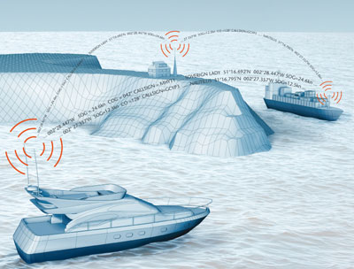

## AIS HUB

AISHub is a FREE AIS data sharing service which provides access to real time ship positions for vessel tracking systems.

# Ports

*   Bordeaux - **missing AIS data** - antenna with bad range (on AIS HUB)
*   Thessaloniki - **NO** AIS data (on AIS HUB)
*   Monfalcone - **good** AIS data
*   Pireas - **good** AIS data 

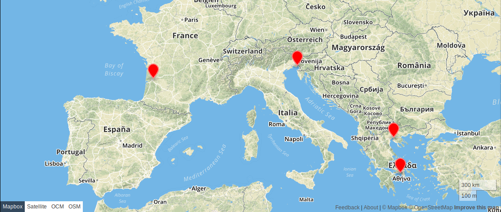

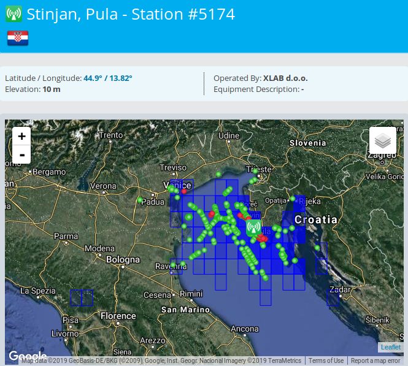

## Bordeaux

Vessels heatmap 

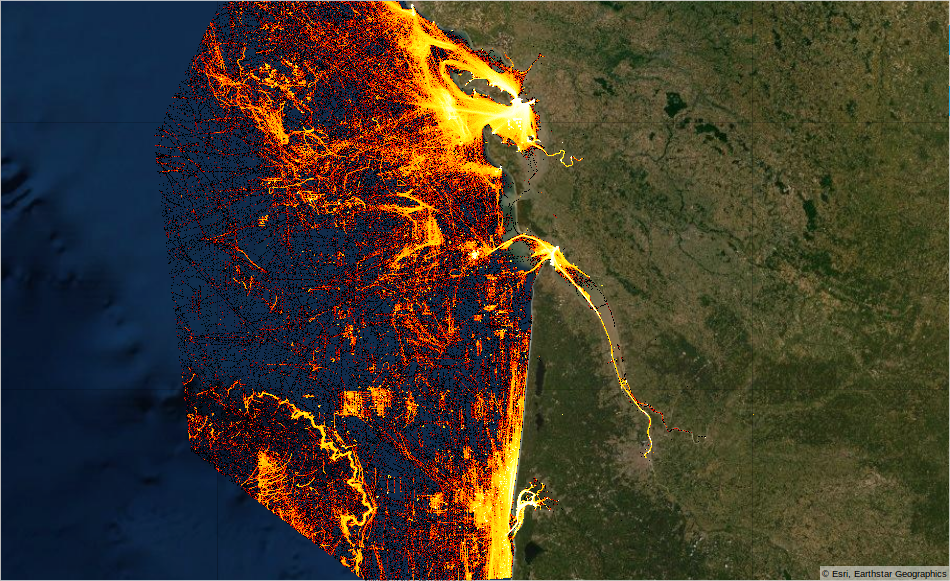

Navigational status 

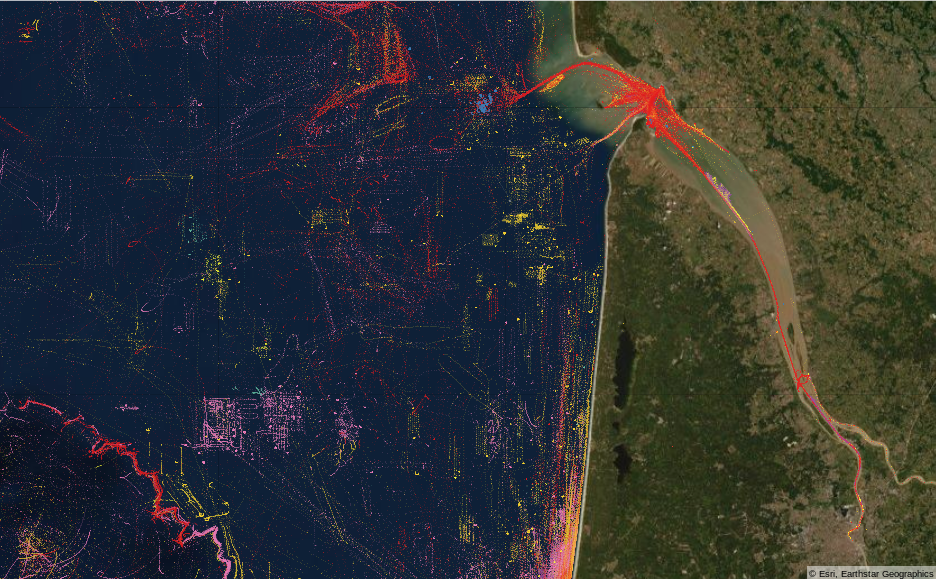

#### Detecting arrivals and departures from AIS data and Short-term ETA (Estimated Time of Arrival)

The AIS receiver connected to AISHUB has low range and usually doesn't get AIS messages from Bassens terminal. 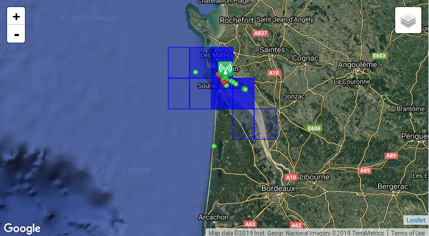

ETA predictions for vessels in Gironde estuary (3-5 hours before arrival - MAE is 20 min). 

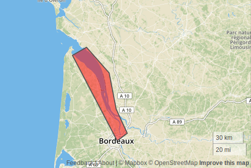

ETA error corelated with distance to Bassens 

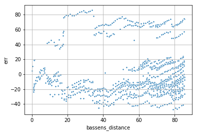

Bassens distance distribution (small number of messages from vessels close to Bassens - weak AIS reciever) 

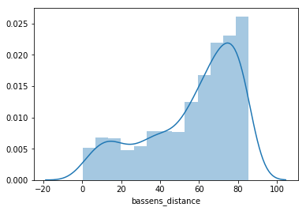

## Monfalcone

### All collected AIS data in Adriatic sea.

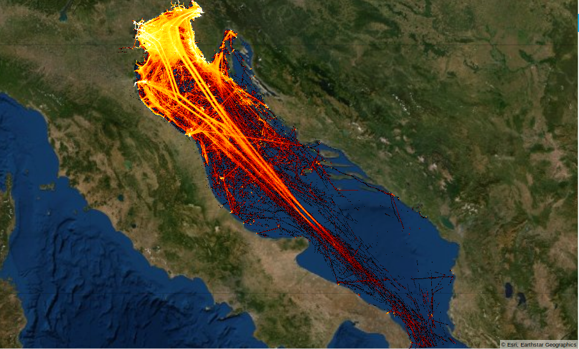

### Filtered by vessel type (70-89 cargo vessels and tankers).

It takes almost 2 days from south part of Adriatic sea to north part.
 
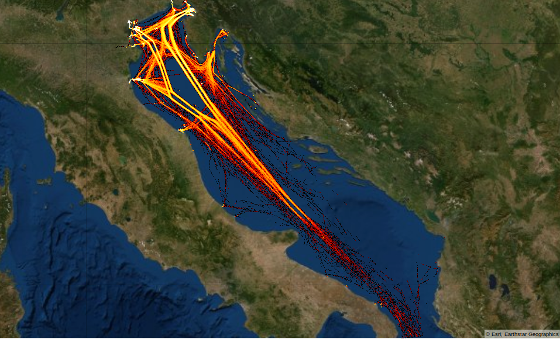

### AIS Navigational status

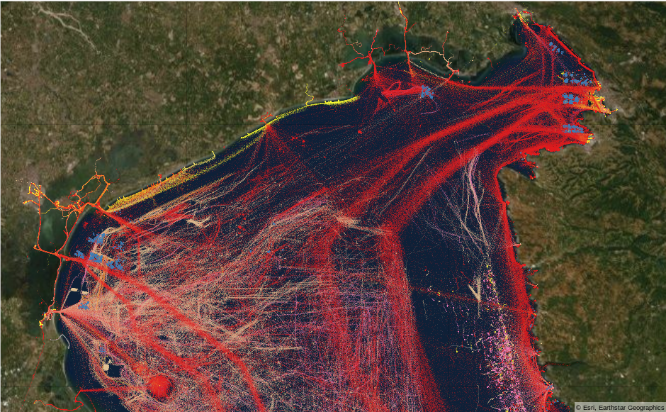

## Pireas

*   Some vessel calls data
*   Good live AIS data

### Vessels heatmap

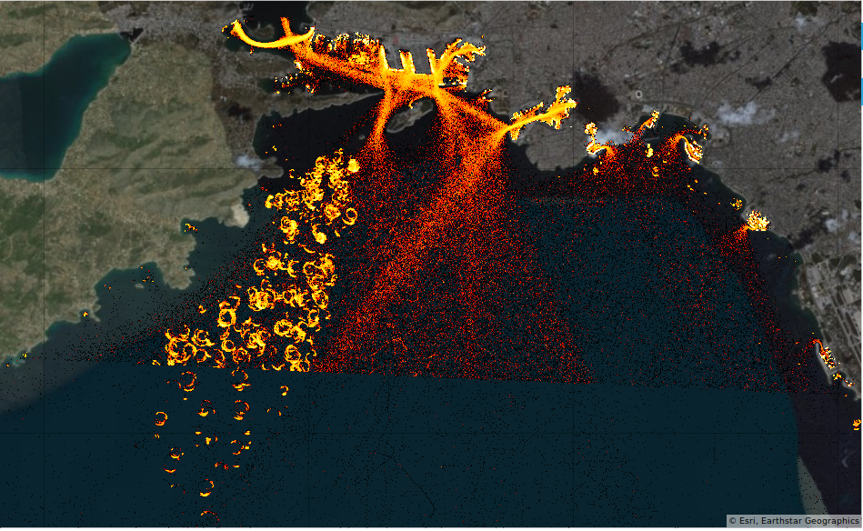

### Bunkering

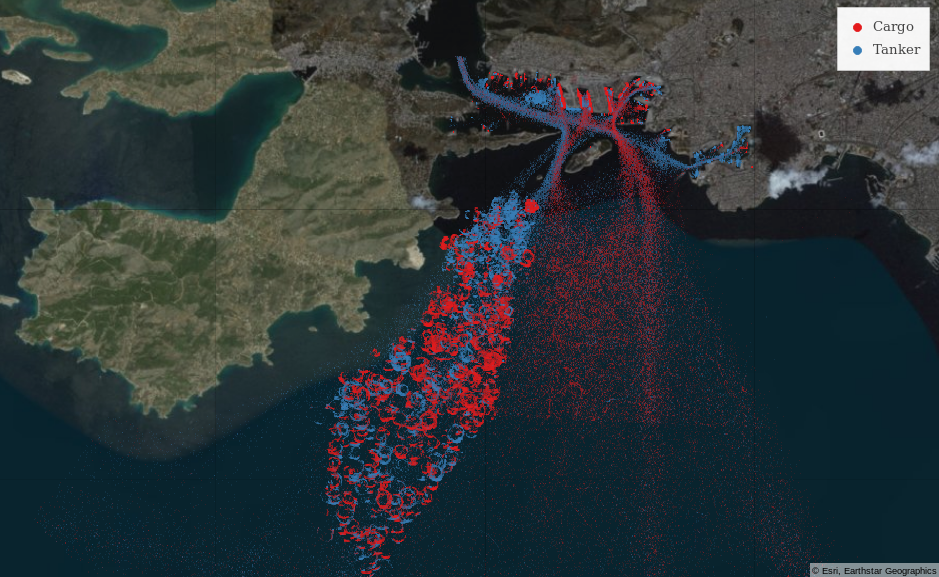 

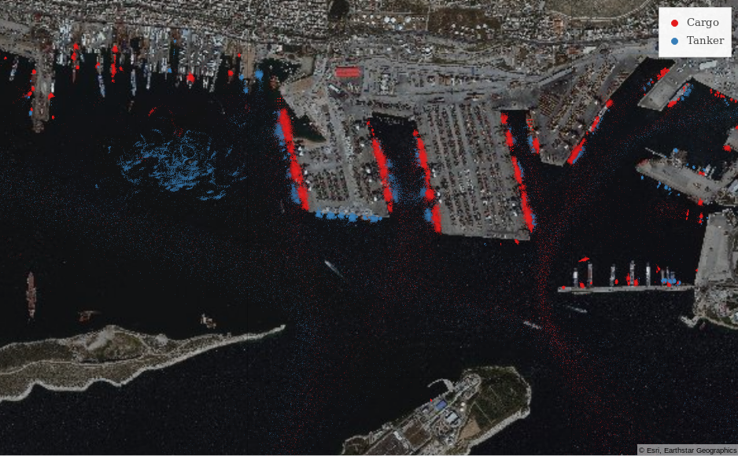 

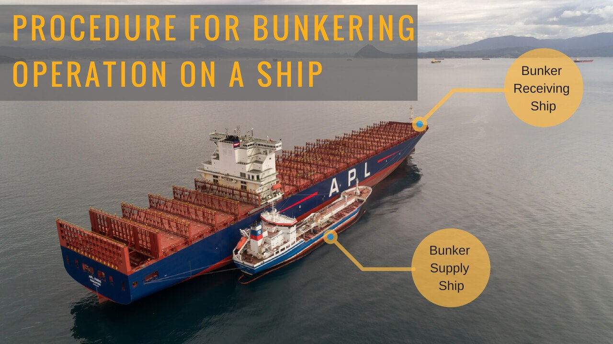

### Navigational status

#### AIS Navigational status

Problems with AIS navigational status

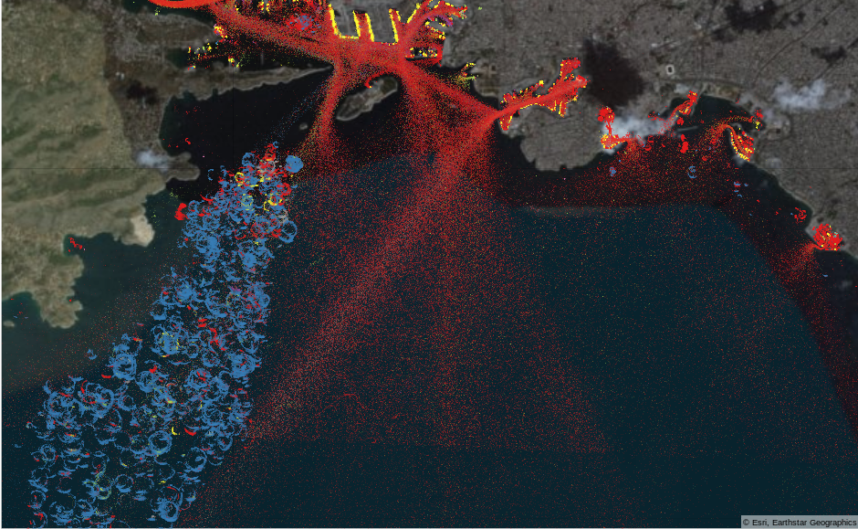

#### PIXEL Navigational status

Based on:

*   location
*   speed
    *   AIS speed can be inaccurate, so we have to calculate speed based on travelled distance and time passed between two AIS emssages
*   "smoothen" navigational status with rolling mode (select most common navigational status from current, previous and next navigational status)

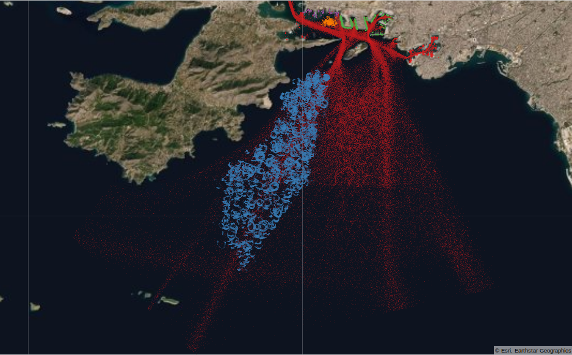

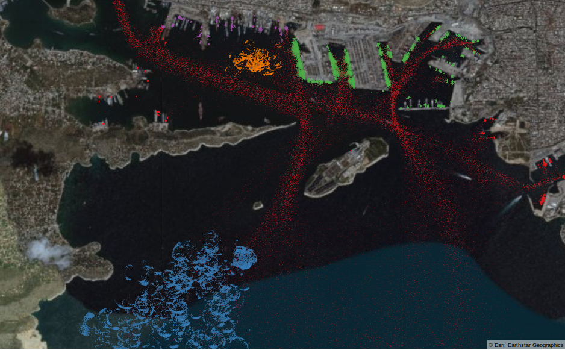

With accurate navigational status we can:

*   Detect arrivals and departures from AIS data.
*   Caluclate statistics of waitting (anchored) time, moored time...
*   Trends and extreme outliers in waiting time, cargo processing time...
*   Congestion index
*   Group AIS messages in voyages

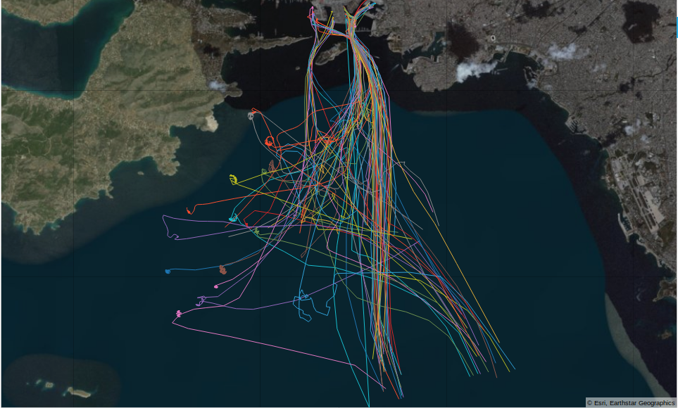

Ferry voyages in 3 months

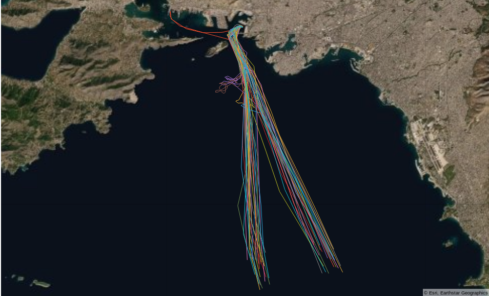

With grouped messages in voyages, we can calculate, how much time vessel was in specific navigational status (moored, anchored, under way using engine ...). We can detect outliers and calculate trends.

<table>
   <thead>
      <tr>
         <th>MMSI</th>
         <th>VOYAGE START</th>
         <th>NAVSTAT</th>
         <th>NAVSTAT START TIME</th>
         <th>TIME IN NAVSTATE</th>
      </tr>
   </thead>
   <tbody>
      <tr>
         <td>210001000</td>
         <td>2019-07-06 02:47:14</td>
         <td>0</td>
         <td>1561899967</td>
         <td>0.250000</td>
      </tr>
      <tr>
         <td>210001000</td>
         <td>2019-07-06 02:47:14</td>
         <td>1</td>
         <td>1562382434</td>
         <td>14.206944</td>
      </tr>
      <tr>
         <td>210001000</td>
         <td>2019-07-06 02:47:14</td>
         <td>0</td>
         <td>1562434335</td>
         <td>2.333333</td>
      </tr>
      <tr>
         <td>210001000</td>
         <td>2019-07-06 02:47:14</td>
         <td>5</td>
         <td>1562443334</td>
         <td>17.258333</td>
      </tr>
      <tr>
         <td>210001000</td>
         <td>2019-07-06 02:47:14</td>
         <td>0</td>
         <td>1562506327</td>
         <td>0.415278</td>
      </tr>
      <tr>
         <td>210001000</td>
         <td>2019-07-13 05:26:17</td>
         <td>0</td>
         <td>1562506327</td>
         <td>0.258333</td>
      </tr>
      <tr>
         <td>210001000</td>
         <td>2019-07-13 05:26:17</td>
         <td>1</td>
         <td>1562996808</td>
         <td>31.207222</td>
      </tr>
      <tr>
         <td>210001000</td>
         <td>2019-07-13 05:26:17</td>
         <td>0</td>
         <td>1563109614</td>
         <td>2.100278</td>
      </tr>
      <tr>
         <td>210001000</td>
         <td>2019-07-13 05:26:17</td>
         <td>5</td>
         <td>1563117775</td>
         <td>27.563056</td>
      </tr>
      <tr>
         <td>210001000</td>
         <td>2019-07-13 05:26:17</td>
         <td>0</td>
         <td>1563217621</td>
         <td>0.419444</td>
      </tr>
      <tr>
         <td>210001000</td>
         <td>2019-07-19 16:18:38</td>
         <td>0</td>
         <td>1563217621</td>
         <td>0.666944</td>
      </tr>
      <tr>
         <td>210001000</td>
         <td>2019-07-19 16:18:38</td>
         <td>1</td>
         <td>1563555818</td>
         <td>39.868889</td>
      </tr>
      <tr>
         <td>210001000</td>
         <td>2019-07-19 16:18:38</td>
         <td>0</td>
         <td>1563699997</td>
         <td>2.352500</td>
      </tr>
      <tr>
         <td>210001000</td>
         <td>2019-07-19 16:18:38</td>
         <td>5</td>
         <td>1563709068</td>
         <td>7.853889</td>
      </tr>
      <tr>
         <td>210001000</td>
         <td>2019-07-19 16:18:38</td>
         <td>0</td>
         <td>1563737996</td>
         <td>0.582500</td>
      </tr>
      <tr>
         <td>210001000</td>
         <td>2019-07-27 04:40:59</td>
         <td>0</td>
         <td>1563737996</td>
         <td>0.833333</td>
      </tr>
      <tr>
         <td>210001000</td>
         <td>2019-07-27 04:40:59</td>
         <td>1</td>
         <td>1564205759</td>
         <td>4.929722</td>
      </tr>
      <tr>
         <td>210001000</td>
         <td>2019-07-27 04:40:59</td>
         <td>0</td>
         <td>1564224166</td>
         <td>1.255278</td>
      </tr>
      <tr>
         <td>210001000</td>
         <td>2019-07-27 04:40:59</td>
         <td>5</td>
         <td>1564229303</td>
         <td>23.021111</td>
      </tr>
      <tr>
         <td>210001000</td>
         <td>2019-07-27 04:40:59</td>
         <td>0</td>
         <td>1564312830</td>
         <td>0.758611</td>
      </tr>
   </tbody>
</table>

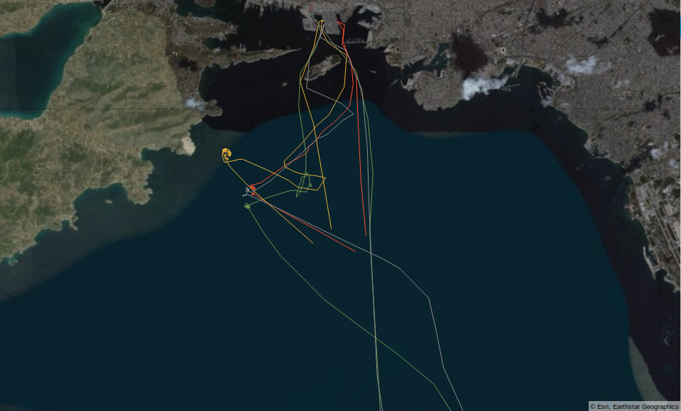

